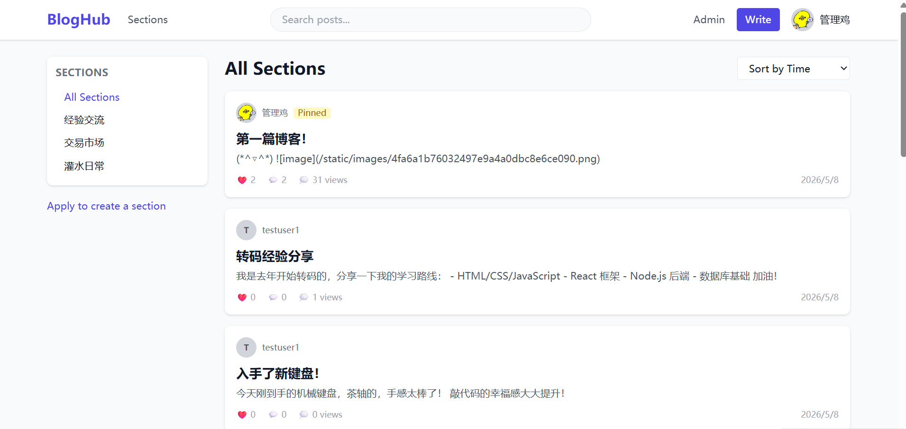
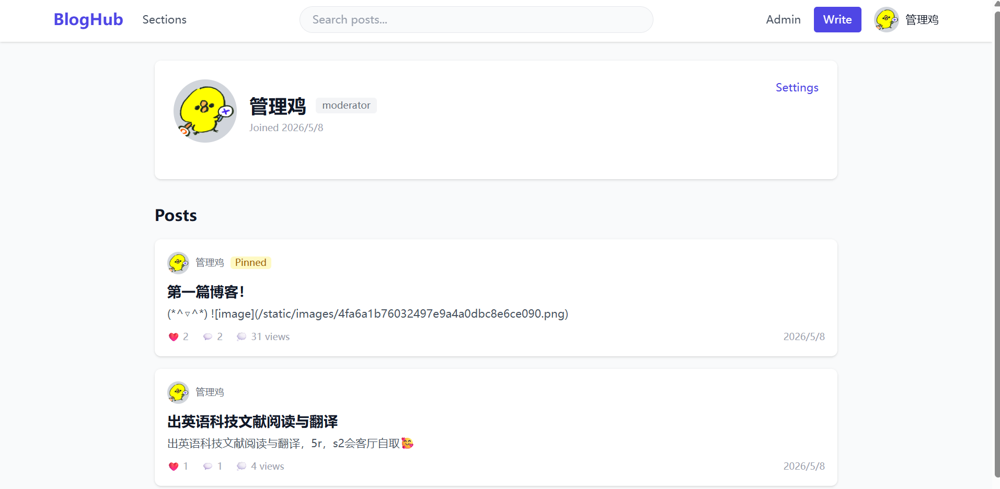
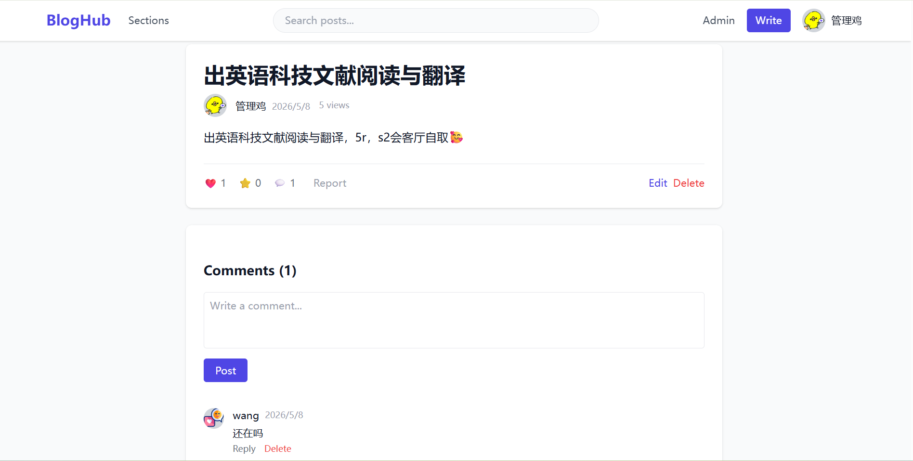
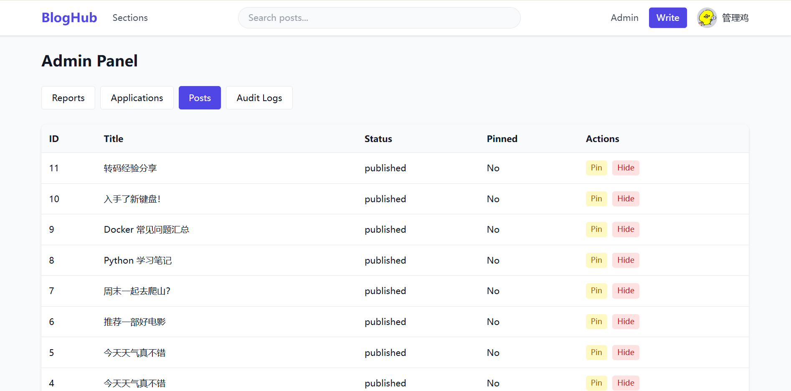

# BlogHub — 博客社区平台

基于 FastAPI + React + PostgreSQL 的全栈博客社区平台，支持多级板块分类、文章互动、评论系统和后台管理。

## 技术栈

| 层 | 技术 |
|-------|-----------|
| **后端** | FastAPI, SQLAlchemy 2.0 (async), PostgreSQL 16, Alembic |
| **认证** | JWT (python-jose, HS256), bcrypt (passlib) |
| **前端** | React 18, Vite, TailwindCSS 3, React Router 6, Axios |
| **渲染** | Markdown (marked) |
| **部署** | Docker Compose（三容器） |

## 功能特性

### 用户系统
- 注册、登录（JWT 认证，7 天有效期）
- 个人资料编辑：用户名、个人简介、修改密码
- 头像上传（图片类型/大小/完整性校验，基于 Pillow）
- 角色权限体系：`user`（普通用户）/ `moderator`（版主）/ `admin`（管理员）

### 板块系统
- 多层嵌套板块树（自引用 parent_id）
- 用户申请创建板块 → 管理员审批流程
- 审批通过后自动将申请人提升为版主
- 板块模块配置（文章 / 公告）

### 文章系统
- 完整的增删改查，支持 Markdown 内容
- 封面图片
- 点赞 / 收藏互动（同一用户对同一文章每种互动类型唯一）
- 浏览计数（每次详情页访问 +1）
- 置顶 / 隐藏（管理员操作，记录审计日志）
- 搜索（标题 ILIKE 模糊匹配）、排序（时间/点赞/收藏）、分页

### 评论系统
- 多层嵌套回复（parent_id 自引用）
- 发表和删除评论（作者或版主/管理员可删）

### 举报系统
- 对文章、评论、用户进行举报
- 管理员处理：已解决 / 驳回，留审计记录

### 管理后台
- 四个标签页：举报管理、板块申请、文章管理、审计日志
- 审批/驳回板块申请（通过后自动创建板块和模块）
- 管理全部文章（置顶、隐藏）
- 处理举报
- 查看审计日志

### 文件上传
- 支持的格式：jpg, jpeg, png, gif, webp
- 大小限制：5 MB
- UUID 重命名，Pillow 验证完整性，本地存储

### UI / UX
- TailwindCSS 响应式布局
- 板块树侧边栏导航
- 文章卡片网格展示（封面、互动数）
- 骨架屏加载态、空状态提示、Toast 消息通知
- 带省略号的分页组件
- 嵌套评论线程，支持回复

## 效果示例

### 整体博客概览



### 个人主页



### 博客与评论



### 管理员界面



## 快速开始

### 使用 Docker（推荐）

```bash
# 进入项目目录
cd blog-platform

# 复制环境配置
cp .env.example .env

# 启动所有服务
docker compose up -d

# 执行数据库迁移
docker compose exec backend alembic upgrade head

# 访问地址：
# 前端页面：http://localhost:5173
# API 接口：http://localhost:8000
# API 文档：http://localhost:8000/docs
```

### 本地开发

#### 后端

```bash
cd backend
python -m venv venv
source venv/bin/activate  # Windows: venv\Scripts\activate
pip install -r requirements.txt

# 复制并编辑 .env（将 DATABASE_URL 改为本地数据库地址）
cp ../.env.example .env

# 执行迁移
alembic upgrade head

# 启动开发服务器
uvicorn app.main:app --reload --host 0.0.0.0 --port 8000
```

#### 前端

```bash
cd frontend
npm install
npm run dev     # 开发服务器 http://localhost:5173，自动代理 /api 到后端
```

### 获取管理员权限

注册账户后，通过 SQL 提升为管理员：

```bash
docker compose exec postgres psql -U blog_user -d blog_db \
  -c "UPDATE users SET role='admin' WHERE username='your_username';"
```

## 环境变量

详见 `.env.example`：

| 变量 | 默认值 | 说明 |
|----------|---------|-------------|
| `DATABASE_URL` | — | PostgreSQL 异步连接字符串 |
| `JWT_SECRET` | `change-this-to-a-random-secret-key` | JWT 签名密钥 |
| `JWT_ALGORITHM` | `HS256` | JWT 签名算法 |
| `ACCESS_TOKEN_EXPIRE_DAYS` | `7` | Token 过期天数 |
| `UPLOAD_DIR` | `uploads` | 文件上传目录 |
| `MAX_UPLOAD_SIZE` | `5242880` | 上传大小限制（字节，5MB） |
| `CORS_ORIGINS` | `http://localhost:5173` | 允许的 CORS 域名 |
| `HOST` | `0.0.0.0` | 服务监听地址 |
| `PORT` | `8000` | 服务端口 |

## API 概览

共 27 个端点，分布在 7 个路由器：

| 路由器 | 端点数 | 功能 |
|--------|--------|------|
| `/api/users` | 6 | 注册、登录、资料 CRUD、头像上传 |
| `/api/posts` | 8 | 文章 CRUD、点赞/收藏切换 |
| `/api/comments` | 3 | 查看评论列表、发表、删除 |
| `/api/sections` | 3 | 查看板块树、申请创建板块 |
| `/api/reports` | 1 | 提交举报 |
| `/api/admin` | 8 | 文章管理、举报审核、申请审批、审计日志 |
| `/api/upload` | 1 | 上传图片 |

所有响应统一格式：`{"code": 0, "data": ..., "msg": "ok"}`

## 项目结构

```
blog-platform/
├── backend/
│   ├── alembic/              # 数据库迁移
│   │   └── versions/
│   │       ├── 0001_initial.py      # 初始建表（7 张表 + 枚举）
│   │       └── 0002_refactor.py     # 移除 VIP、转发、用户主题字段
│   ├── app/
│   │   ├── main.py           # FastAPI 应用入口，CORS、静态文件、路由注册
│   │   ├── config.py         # Pydantic-settings 配置
│   │   ├── database.py       # 异步 SQLAlchemy 引擎和会话
│   │   ├── dependencies.py   # JWT 认证 + 管理员权限依赖
│   │   ├── models/           # SQLAlchemy ORM 模型（7 张表）
│   │   │   ├── user.py       # 用户
│   │   │   ├── section.py    # 板块、板块模块、板块申请
│   │   │   ├── post.py       # 文章、文章互动
│   │   │   ├── comment.py    # 评论
│   │   │   ├── report.py     # 举报
│   │   │   └── audit_log.py  # 审计日志
│   │   ├── schemas/          # Pydantic 请求/响应模型
│   │   ├── routers/          # API 路由处理器
│   │   ├── services/         # 业务逻辑层（审计服务）
│   │   └── utils/            # 文件上传工具
│   ├── Dockerfile
│   └── requirements.txt
├── frontend/
│   ├── src/
│   │   ├── api/              # Axios 客户端 + 各资源 API 模块
│   │   ├── store/            # AuthContext（JWT）+ ToastContext
│   │   ├── hooks/            # usePosts 自定义 Hook
│   │   ├── components/       # 通用组件：导航栏、文章卡片、板块树、
│   │   │                     # 评论列表、分页、模态框、空状态、骨架屏、头像
│   │   ├── pages/            # 11 个页面级组件
│   │   ├── App.jsx           # 路由定义
│   │   └── main.jsx          # 应用入口
│   ├── nginx.conf            # 生产环境 Nginx 配置（SPA + API 反向代理）
│   ├── Dockerfile            # 多阶段构建：Vite 编译 → nginx-alpine
│   └── package.json
├── docker-compose.yml        # postgres + backend + frontend
├── pics/                     # 项目截图（README 效果示例用）
├── .env.example
└── README.md
```

## 数据库表结构

由 Alembic 迁移维护的 9 张表：

| 表 | 主要字段 |
|-----|---------|
| **users** | id, username, email, password_hash, avatar_url, bio, role（枚举）, 时间戳 |
| **sections** | id, name, description, parent_id（自引用）, creator_id, status（active/archived） |
| **section_modules** | id, section_id, module_type（post/announcement） |
| **section_applications** | id, applicant_id, app_type, name, description, reason, status, reviewer_id |
| **posts** | id, title, content, cover_image, author_id, section_id, status, is_pinned, view_count, 时间戳 |
| **post_interactions** | id, user_id, post_id, type（like/favorite）, 唯一约束(user, post, type) |
| **comments** | id, post_id, author_id, content, parent_id（自引用）, 时间戳 |
| **reports** | id, reporter_id, target_type, target_id, reason, status, reviewer_id |
| **audit_logs** | id, operator_id, action, target_type, target_id, detail（JSON）, 时间戳 |

## Docker 服务编排

| 服务 | 基础镜像 | 端口 | 依赖 |
|---------|-----------|------|-------------|
| `postgres` | postgres:16-alpine | 5432 | — |
| `backend` | python:3.12-slim | 8000 | postgres（健康检查通过后） |
| `frontend` | node:20 构建 → nginx:alpine | 5173 → 80 | backend |

## 已知未实现

- 邮箱验证 / 密码重置
- OAuth / 第三方登录
- 富文本编辑器（当前使用 Markdown 纯文本输入）
- 图片压缩/优化
- 通知系统
- 实时功能（WebSocket）
- 全文搜索引擎（当前使用 SQL ILIKE）
- 用户屏蔽
- 移动端响应式深度优化（仅 Tailwind 基础适配）

## 代码规模

| 模块 | 行数 |
|------|------|
| **后端 Python** | **~1,566** |
| ├─ Models（6 个模型） | 237 |
| ├─ Routers（7 个路由器） | 590 |
| ├─ Schemas（请求/响应模型） | 180 |
| ├─ main / config / database / dependencies | 118 |
| └─ Alembic 迁移 | 301 |
| **前端 JSX/JS/CSS** | **~1,704** |
| ├─ Pages（9 个页面） | 1,112 |
| ├─ Components（9 个组件） | 353 |
| ├─ API 层（client + 7 个模块） | 77 |
| ├─ Store / Hooks | 101 |
| └─ main.jsx + App.jsx + index.css | 61 |
| **配置/部署文件** | **~233** |
| (docker-compose, Dockerfiles, nginx, vite, tailwind, .env 等) | |
| **总计** | **~3,500 行** |
